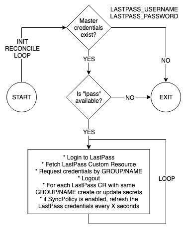

# lastpass-operator

[![Build Status][build-image]][build-url]
[![Docker Tag][tag-image]][tag-url]

[build-image]: https://img.shields.io/travis/edgelevel/lastpass-operator.svg?style=popout-square
[build-url]: https://travis-ci.org/edgelevel/lastpass-operator
[tag-image]: https://img.shields.io/github/tag/edgelevel/lastpass-operator.svg?style=popout-square&color=blue
[tag-url]: https://hub.docker.com/r/edgelevel/lastpass-operator

A Kubernetes Operator to manage [secrets](https://kubernetes.io/docs/concepts/configuration/secret) stored in [LastPass](https://www.lastpass.com) password manager

## How it works

Suppose you have some credentials stored in LastPass
```bash
$ lpass show example/my-secret --json
[
  {
    "id": "8190226423897406876",
    "name": "my-secret",
    "fullname": "example/my-secret",
    "username": "whoami",
    "password": "s3cr3t",
    "last_modified_gmt": "1562690587",
    "last_touch": "0",
    "group": "example",
    "url": "https://lastpass.com",
    "note": "{\"myKey\":\"myValue\"}"
  }
]
```

Define a `LastPass` [Custom Resource](https://kubernetes.io/docs/concepts/extend-kubernetes/api-extension/custom-resources) to automatically manage the lifecycle of your secrets in Kubernetes
```bash
$ cat example/edgelevel_v1alpha1_lastpass_cr.yaml
apiVersion: edgelevel.com/v1alpha1
kind: LastPass
metadata:
  name: example-lastpass
spec:
  secretRef:
    group: example
    name: my-secret
    withUsername: true
    withPassword: true
    withUrl: true
    withNote: true
  syncPolicy:
    enabled: true
    refresh: 10

# create a custom resource
$ kubectl apply -f example/edgelevel_v1alpha1_lastpass_cr.yaml
```

The operator will take care of create native Kubernetes secrets and keep them up to date that if they change
```bash
# verify
$ kubectl get lastpass
$ kubectl get secrets

# inspect
$ kubectl get secret example-lastpass-8190226423897406876 -o yaml
apiVersion: v1
data:
  NOTE: eyJteUtleSI6Im15VmFsdWUifQ==
  PASSWORD: czNjcjN0
  URL: aHR0cHM6Ly9sYXN0cGFzcy5jb20=
  USERNAME: d2hvYW1p
kind: Secret
metadata:
  annotations:
    fullname: example/my-secret
    group: example
    id: "8190226423897406876"
    lastModifiedGmt: "1562690587"
    lastTouch: "0"
    name: my-secret
  creationTimestamp: "2019-07-09T15:00:13Z"
  labels:
    app: lastpass-operator
  name: example-lastpass-8190226423897406876
  namespace: default
  ownerReferences:
  - apiVersion: edgelevel.com/v1alpha1
    blockOwnerDeletion: true
    controller: true
    kind: LastPass
    name: example-lastpass
    uid: 0687d5a7-5f02-4ee4-a6c4-011c734f4149
  resourceVersion: "113312"
  selfLink: /api/v1/namespaces/default/secrets/example-lastpass-8190226423897406876
  uid: 382008d2-8999-444d-86c8-e4f29eecbe9f
type: Opaque

# check values
$ echo 'czNjcjN0' | base64 --decode
s3cr3t
$ echo 'eyJteUtleSI6Im15VmFsdWUifQ==' | base64 --decode | jq -c
{"myKey":"myValue"}
```

Metrics are exposed by default in Prometheus [format](https://prometheus.io/docs/instrumenting/exposition_formats), see an [example](example/metrics.txt)
```bash
# port forward
kubectl port-forward service/lastpass-operator -n lastpass 8080:8383

# request metrics
http :8080/metrics
```

## Considerations

* If you want to understand how the operator works, you should have a look at the `Reconcile` method defined in [lastpass_controller](https://github.com/edgelevel/lastpass-operator/blob/master/pkg/controller/lastpass/lastpass_controller.go) and at the [CustomResourceDefinition](https://github.com/edgelevel/lastpass-operator/blob/master/chart/templates/crd.yaml)
* The diagram below explains the core logic of the reconcile loop

<p align="center">
  
</p>

* The recommended way to install the operator in a cluster is by applying the provided Helm [chart](chart/)
* *TODO for a working example you should have a look at [niqdev/do-k8s](https://github.com/niqdev/do-k8s)*
* This operator has been mainly developed to simplify the secret management of low security environments, if you are a security paranoid you should audit this project and assess if it meets the security standard of your organization
* The operator, for obvious reasons, won't work if you have MFA enabled on LastPass or your credentials "Require Password Reprompt"
* Once [this](https://github.com/argoproj/argo-cd/issues/1786) Argo CD feature will be implemented it should allow to bind secrets directly to an `Application`

## Development

* [Setup](docs/setup.md)
* [golang](docs/golang.md)
* [operator-sdk](docs/operator.md)
* [LastPass](docs/lastpass.md)

```bash
# download source
mkdir -p $GOPATH/src/github.com/edgelevel && cd $_
git clone git@github.com:edgelevel/lastpass-operator.git
cd lastpass-operator

# install dependencies
dep ensure
```

Run locally outside the cluster on [minkube](https://github.com/kubernetes/minikube)
```bash
# requires virtualbox
minikube start

# apply crd
kubectl apply -f chart/templates/crd.yaml

# run locally
export OPERATOR_NAME=lastpass-operator
export LASTPASS_USERNAME=myUsername
export LASTPASS_PASSWORD=myPassword
operator-sdk up local --namespace=default --verbose
```

Run as a Deployment inside the cluster
```bash
# build and publish manually
# https://hub.docker.com/u/edgelevel
make docker-push tag=X.Y.Z docker-password=XYZ

# apply chart
helm template \
  --values chart/values.yaml \
  --set lastpass.username="myUsername" \
  --set lastpass.password="myPassword" \
  chart/ | kubectl apply -n lastpass -f -
```

Debug issues
```bash
# verify logs
kubectl logs deployment/lastpass-operator -n lastpass -f

# access container
kubectl exec -it lastpass-operator-XXX sh -n lastpass
lpass --version
ls -la .lpass/
```

---

TODO
* [ ] add logging for every error e.g. `return reconcile.Result{}, err`
* [ ] review logging of sensible informations
* [ ] fix version of lastpass-cli and alpine
* [ ] add license
* [ ] publish to [OperatorHub](https://operatorhub.io/contribute)
* [ ] add extra metrics
